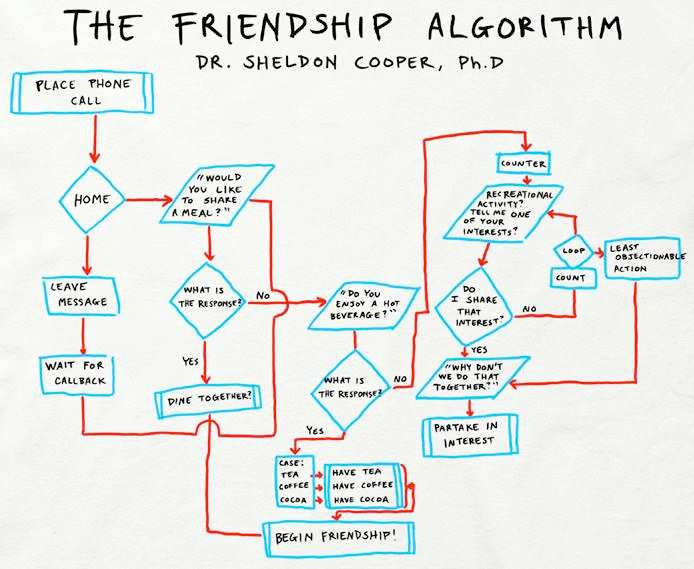

# The Friendship Algorithm Game

A game where Emmy tries to befriend characters. She tries hard but sometimes makes acoustic choices. Help her out.\
Inspired by [the Oregon Trail](https://en.wikipedia.org/wiki/The_Oregon_Trail_(series)) and the Big Bang Theory's [Friendship Algorithm](https://www.youtube.com/watch?v=k0xgjUhEG3U).

## Download & Play

1. Go to the [Releases](https://github.com/emmydunsford/bff_branch/releases) page
2. Download the latest release zip file in "Assets" (the first one, and **not** the Source Code files!!)
3. Extract the zip file
4. Open the extracted folder
5. Double click `index.html` to play in your browser

## Features

- Multiple friendship paths and outcomes
- Shared interests system (vibes, activities, beverages)
- Friendship levels with visual indicators
- Risk of becoming enemies (💔)
- And a hidden toxic path (🔥)

## How to Play

1. Choose a character to befriend
2. Follow the Friendship Algorithm steps
3. Make choices that align with their interests
4. Try to avoid becoming enemies
5. Watch your friendship level grow (or crash and burn)

## For Developers

### Installation

```bash
# Clone the repository
git clone https://github.com/emmydunsford/bff_branch.git

# Navigate to project directory
cd bff_branch/friendship-game

# Install dependencies
npm install
```

### Development

```bash
# Run in development mode with hot reload
npm run dev

# Build for production
npm run build

# Serve production build
npm start
```

### Tech Stack

- TypeScript
- Webpack
- HTML/CSS


## Reference
